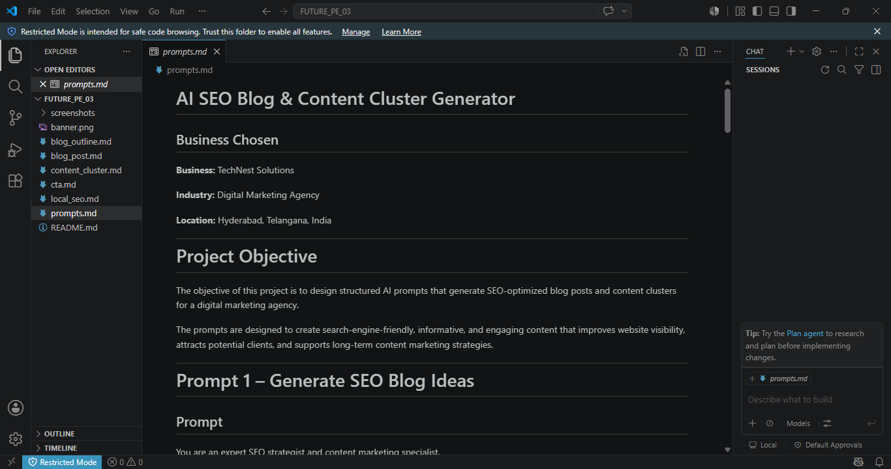
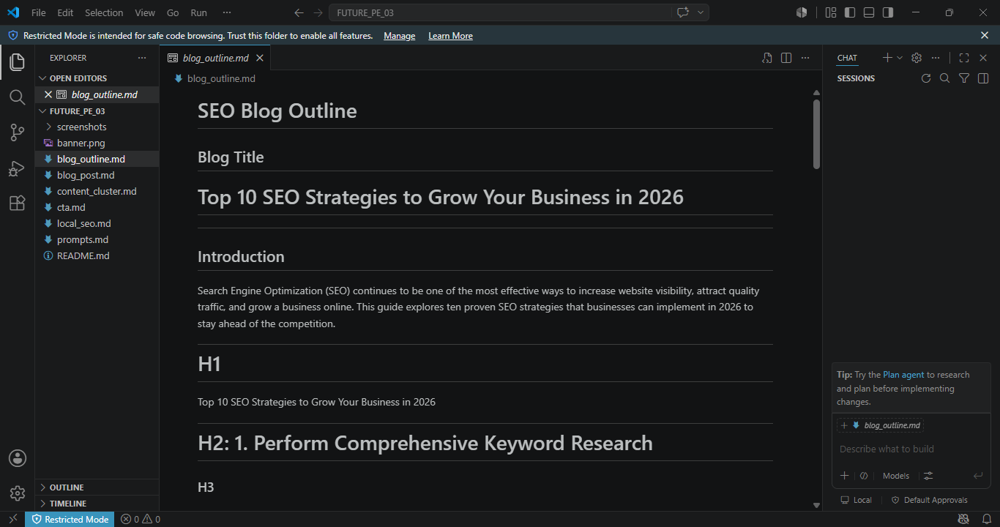
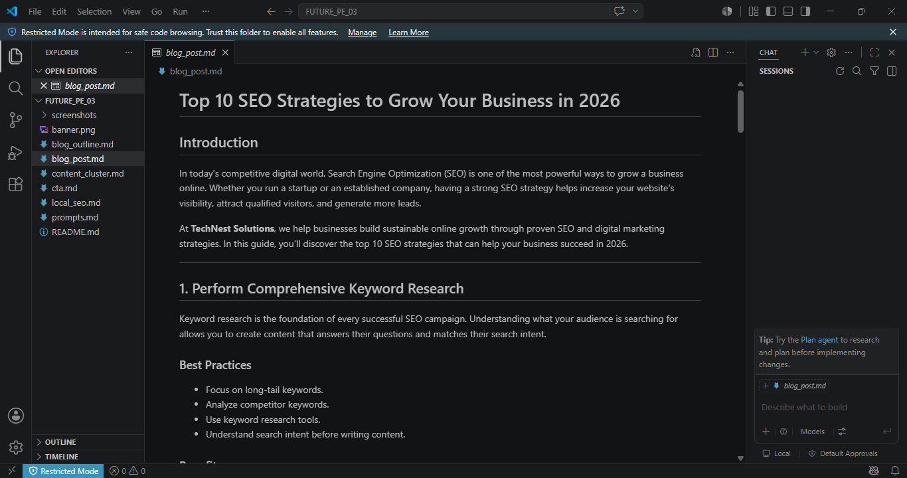
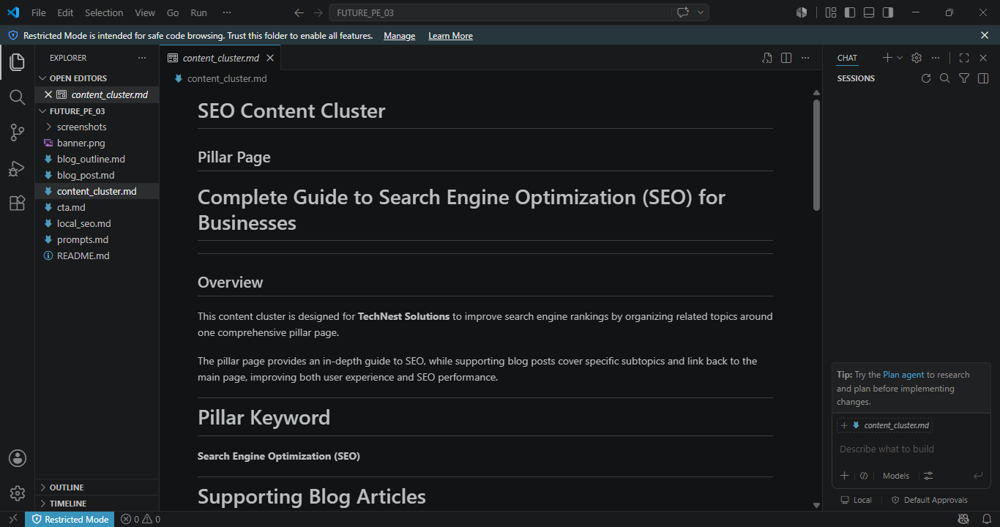
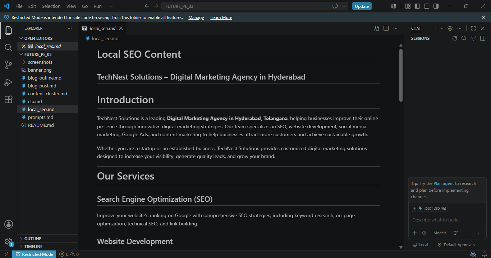
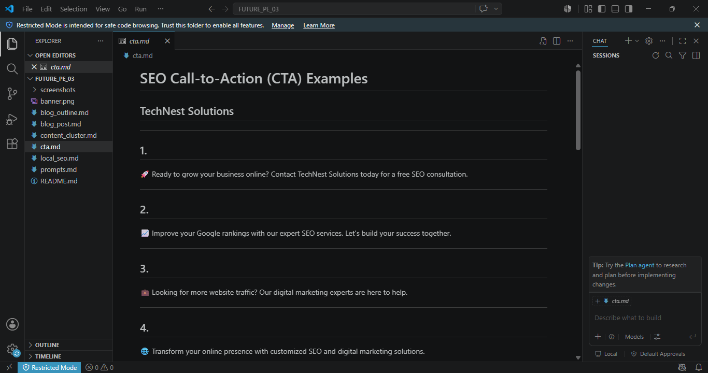

# 🚀 AI SEO Blog & Content Cluster Generator

### Future Interns – Prompt Engineering Internship 2026 | Task 3


---

<p align="center">
  
</p>

---

## 📖 Project Overview

This repository demonstrates how **Prompt Engineering** and **Artificial Intelligence** can be used to generate **SEO-optimized blog posts, content clusters, and local SEO content** for a digital marketing agency.

The project showcases reusable AI prompts that create blog ideas, blog outlines, long-form SEO articles, content clusters, local SEO content, and persuasive Call-to-Action (CTA) examples.

✨ **Goal:** Build a professional AI-powered SEO content generation system while learning Prompt Engineering techniques.

---

## 🚀 Quick Summary

| Category | Details |
|----------|---------|
| **Internship** | Future Interns – Prompt Engineering |
| **Task** | Task 3 |
| **Business** | TechNest Solutions |
| **Industry** | Digital Marketing Agency |
| **Tools** | ChatGPT, VS Code, GitHub, Markdown |
| **Focus** | AI SEO Blog & Content Cluster Generator |

---

## 📑 Table of Contents

- [📖 Project Overview](#-project-overview)
- [🚀 Quick Summary](#-quick-summary)
- [🎯 Project Objective](#-project-objective)
- [🏢 Business Chosen](#-business-chosen)
- [📂 Project Structure](#-project-structure)
- [🛠️ Tools Used](#️-tools-used)
- [📄 Project Files](#-project-files)
- [🤖 Prompt Engineering Workflow](#-prompt-engineering-workflow)
- [🎓 Skills Learned](#-skills-learned)
- [💡 What I Learned](#-what-i-learned)
- [🖼️ Preview Images](#️-preview-images)
- [🚀 Project Highlights](#-project-highlights)
- [🔮 Future Improvements](#-future-improvements)
- [👨‍💻 Author](#-author)

---

## 🎯 Project Objective

The objective of this project is to design structured AI prompts that generate SEO-friendly blog content, content clusters, and local SEO content for a digital marketing agency.

The project demonstrates how Prompt Engineering can be used to create reusable, search-engine-optimized content that helps businesses improve online visibility, attract more visitors, and build long-term content marketing strategies.

---

## 🏢 Business Chosen

**Business:** TechNest Solutions

**Industry:** Digital Marketing Agency

**Location:** Hyderabad, Telangana, India

---

## 📂 Project Structure

```text
FUTURE_PE_03/
│
├── README.md
├── prompts.md
├── blog_outline.md
├── blog_post.md
├── content_cluster.md
├── local_seo.md
├── cta.md
├── banner.png
├── LICENSE
└── screenshots/
```

---

## 🛠️ Tools Used

- 🤖 ChatGPT
- 💻 Visual Studio Code (VS Code)
- 🐙 Git & GitHub
- 📝 Markdown
- 🌐 Google Chrome

---

## 📄 Project Files

| File | Description |
|------|-------------|
| **prompts.md** | AI prompts for generating SEO content |
| **blog_outline.md** | SEO blog outline with H1, H2, and H3 headings |
| **blog_post.md** | Complete SEO-optimized blog article |
| **content_cluster.md** | SEO content cluster and internal linking strategy |
| **local_seo.md** | Local SEO content for TechNest Solutions |
| **cta.md** | SEO-focused Call-to-Action examples |
| **README.md** | Complete project documentation |
| **LICENSE** | MIT License for the project |

---

## 🤖 Prompt Engineering Workflow

```text
Choose Business
        ↓
Define AI Role
        ↓
Write Structured Prompt
        ↓
Generate Blog Ideas
        ↓
Create Blog Outline
        ↓
Generate Long-form SEO Blog
        ↓
Create Content Cluster
        ↓
Generate Local SEO Content
        ↓
Create CTA Examples
        ↓
Document in Markdown
        ↓
Publish to GitHub
```

---

## 🎓 Skills Learned

During this project, I developed the following skills:

- Prompt Engineering
- SEO Content Writing
- Blog Content Planning
- Content Cluster Strategy
- Local SEO Optimization
- AI-assisted Content Generation
- Markdown Documentation
- GitHub Repository Management
- Professional README Design
- Digital Marketing Fundamentals

---

## 💡 What I Learned

This project helped me understand how Prompt Engineering can be used to create SEO-focused content for real businesses.

Key learnings include:

- Designing structured AI prompts for different SEO tasks.
- Creating SEO-friendly blog outlines and long-form articles.
- Building content clusters to improve website organization.
- Writing Local SEO content using location-based keywords.
- Organizing projects professionally using Markdown and GitHub.

---

## 👨‍💻 Author

**Name:** S.SYAM CHANDAN

**Internship:** Future Interns – Prompt Engineering Internship (2026)

**Project:** AI SEO Blog & Content Cluster Generator

**Business:** TechNest Solutions

---

# 🖼️ Prompts Preview



*AI prompts designed to generate SEO blogs, content clusters, and local SEO content.*

---

# 🖼️ Blog Outline Preview



*SEO-friendly blog outline with H1, H2, and H3 headings.*

---

# 🖼️ Blog Post Preview



*Complete AI-generated SEO blog article.*

---

# 🖼️ Content Cluster Preview



*Content cluster strategy with pillar page and supporting blog topics.*

---

# 🖼️ Local SEO Preview



*Location-based SEO content for TechNest Solutions.*

---

# 🖼️ CTA Preview



*Professional Call-to-Action examples for lead generation.*

---

# 🚀 Project Highlights

- 🤖 AI-powered SEO blog content generation
- 📝 Professional SEO blog outlines
- 📚 Long-form SEO blog writing
- 🔗 Content cluster strategy with internal linking
- 📍 Local SEO content generation
- 📢 Persuasive Call-to-Action examples
- 🗂️ Professional Markdown documentation
- 🌐 Portfolio-ready GitHub repository

---

# 🔮 Future Improvements

- Build a live website to showcase SEO blog content.
- Generate AI-powered blog images.
- Add downloadable SEO templates and checklists.
- Expand the project to support multiple industries.
- Integrate AI workflows for automated content generation.
- Create multilingual SEO blog content.

---

# 📄 License

This project is licensed under the **MIT License**.

See the `LICENSE` file for more details.

---

## ⭐ Support

If you found this project helpful, consider giving this repository a ⭐ on GitHub.

It helps support my learning journey and encourages future improvements.

---

<div align="center">

### 🚀 Built with Prompt Engineering, ChatGPT, Markdown, VS Code & GitHub

**Future Interns – Prompt Engineering Internship 2026**

</div>

---

## 👨‍💻 Author

**Name:** S.SYAM CHANDAN

**Internship:** Future Interns – Prompt Engineering Internship (2026)

**Project:** AI SEO Blog & Content Cluster Generator

**Business:** TechNest Solutions
